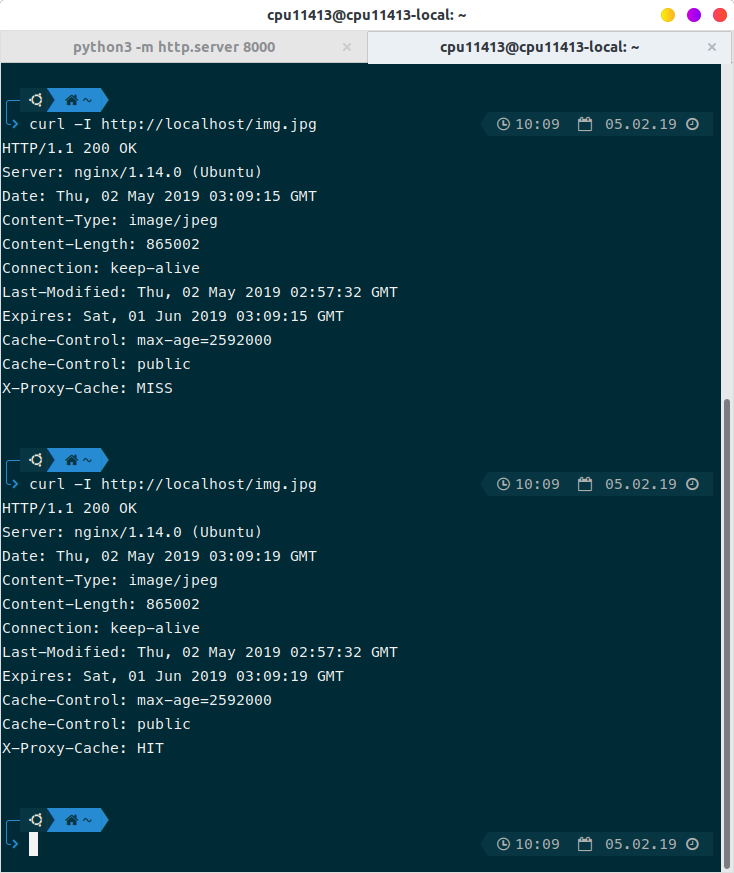

# Caching

 Khởi động server ở thư mục `/caching/source/`

 > python3 -m http.server 8000

Thay đổi config của `nginx` trong `/etc/nginx/sites-enabled/default`

``` C++
proxy_cache_path  /home/cpu11413/Documents/cache levels=1:2 keys_zone=my_zone:10m inactive=60m;

server {
    listen 80;
    server_name  _;

    location ~* \.(?:ico|css|js|gif|jpe?g|png|svg|woff|ttf|eot)$  {
        expires 30d;
        add_header Cache-Control "public";
        proxy_cache_valid any 30m;
        proxy_cache my_zone;
        proxy_pass http://127.0.0.1:8000;
        add_header X-Proxy-Cache $upstream_cache_status; # Thêm status của cache để biết file đã được cache hay chưa?
    }

    location / {
        proxy_pass http://127.0.0.1:8000;
    }

}
```

# Kết quả

Có thể thấy ban đầu `X-Proxy-Cache: MISS` sau khi load lại lần hai status đã đươc thay đổi thành `HIT`

