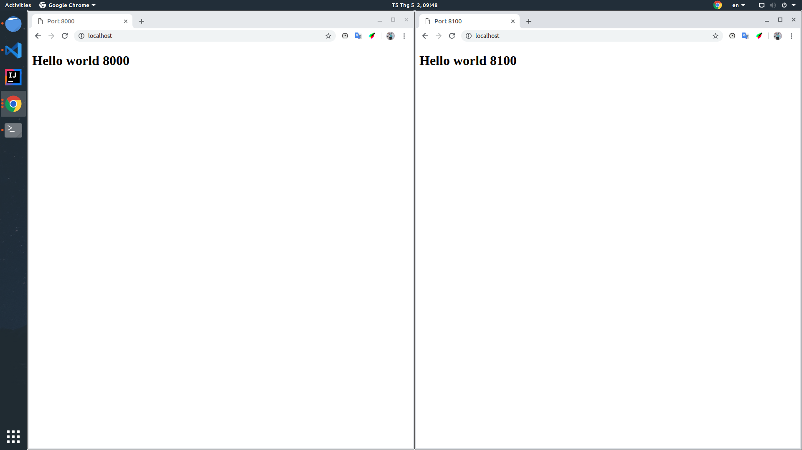

# Load balancer

Tạo file test với `create-file.sh`

``` code
chmod 755 create-file.sh
./create-file.sh
```

Tạo 2 server với python 3

Vào thư mục `8000`

``` code
cd test-load-balancer/8000
python3 -m http.server 8000
```

Vào thư mục `8100`

``` code
cd test-load-balancer/8100
python3 -m http.server 8100
```

Sửa config của `nginx` trong `/etc/nginx/sites-enabled/default`

``` C++
upstream myserver {
    server 127.0.0.1:8000;
    server 127.0.0.1:8100;
}

server {
    location / {
        proxy_pass http://myserver;
    }
}
```

Khởi động lại `nginx`:
> systemctl restart nginx

## Kết quả

