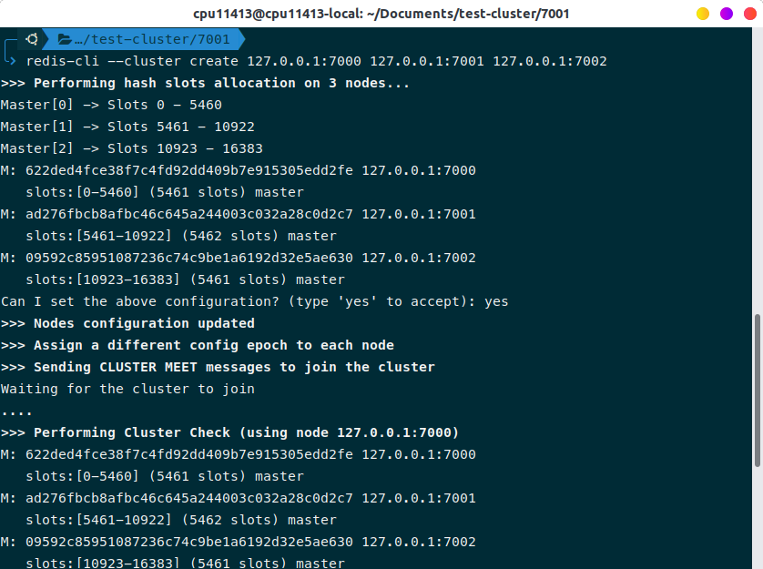

# Config cluster redis 3 node, chạy cùng machine, khác port

**Config này được sử dụng trên redis 5.**

Tạo 3 thư mục chứa config cho từng cluster.

``` code
mkdir test-cluster
cd test-cluster
mkdir 7000 7001 7002
```

Tạo các file config tương ứng cho từng thư mục `700*.conf`

``` code
port 7000
cluster-enabled yes
cluster-config-file nodes.conf
cluster-node-timeout 5000
appendonly yes
```

Khởi động từng server redis

``` code
redis-server ./7000/7000.conf
redis-server ./7000/7001.conf
redis-server ./7000/7002.conf
```

Chia cluster

``` code
redis-cli --cluster create 127.0.0.1:7000 127.0.0.1:7001 127.0.0.1:7002
```

# Kết quả

